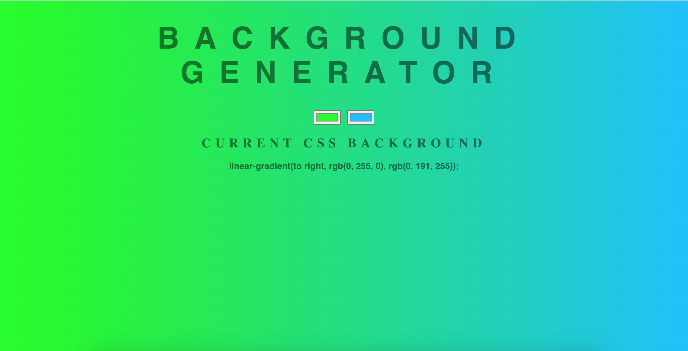
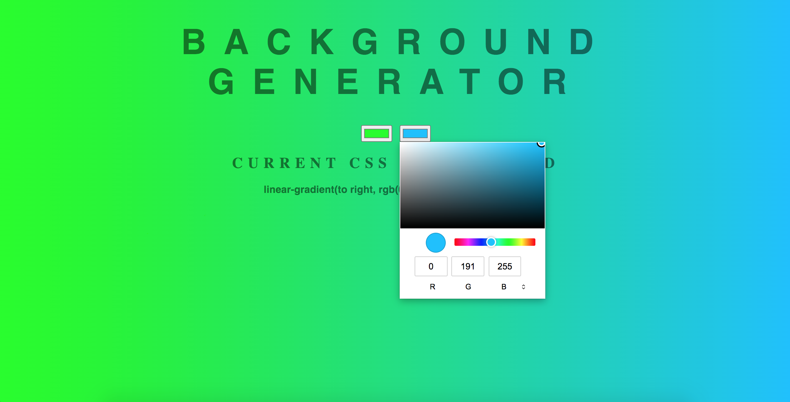
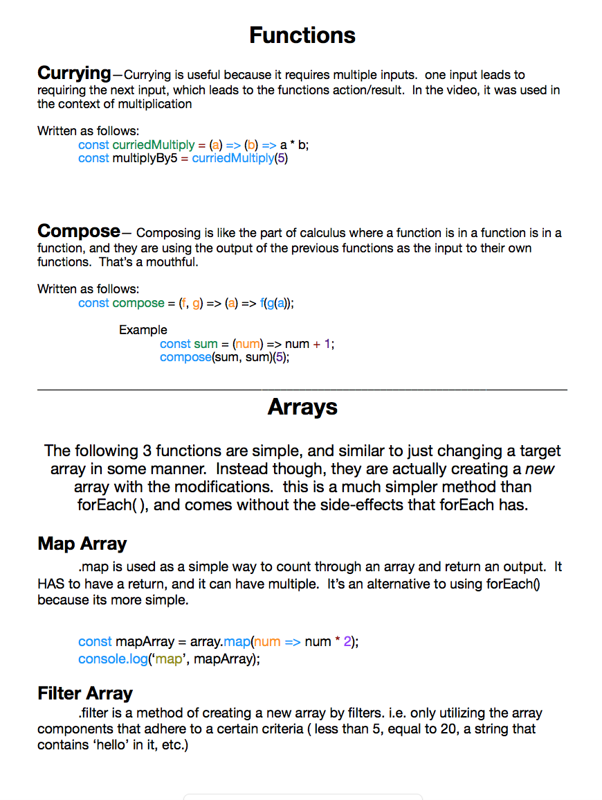

# 100 Days Of Code - Log

### Day 0: July 28, 2020
#####

**Today's Progress**: Began Angela Yu's Complete Web Dev 2020 Bootcamp

**Thoughts:** I'm looking to hone in on some of my programming skills and make sure I'm up-to-date with modern techniques and technologies. As a result, I'm opting to take a modern full-stack course.  I'm wanting to jump into a tech job soon, so I'm diving back in head-first.  Follow along, here we go!

**Link to work:** https://www.udemy.com/course/the-complete-web-development-bootcamp/learn/lecture/12287482#notes

### Day 1: July 29, 2020. Wednesday

**Today's Progress**: Day 1 of Angela's course.  Today I put 3 hours into it so I could complete the intermediate HTML section.  I'm trying to fly through the HTML and CSS sections so I can pick up where I once left off, practicing JavaScript and the other relevant languages for Full-Stack dev.

**Thoughts** Feeling good.  I realized that the course is around 54 hours long of direct videos, and then probably another 40 hours from assignments, note-taking, challenges, et cetera.  It's a lot, but I'd like to have it under my belt.  The goal is to fork a couple of hours into it per day (I'm thinking 4, but weekdays may be difficult because of work.  Otherwise, I'd say more.), so I can complete it within the next month or two.  I'm estimating that for every hour in the course, I'll be spending at least one MORE hour with general practice.  We'll see what happens though, since I'm not sure what to expect as the course moves on.  Today's progress can be viewed below!  Keep in mind that the file is simply what we are walking through in the course, and we are at the beginning.

**Link(s) to work**
1. https://s-munro.github.io/cv/

### Day 2: July 30, 2020. Thursday

**Today's Progress**: Day 2 (three, sort of) of Angela's course.  Today I put a couple more hours into it, and got a little past halfway through the introductory and intermediate CSS portions.  I meant to get all the way through, but that may have been a little ambitious.  A lot of this was still review, but I nevertheless encountered some obstacles and stumbled for a moment.  I've now scrapped that initial website and started working on a semi-official CV website.  I'm going to be introducing myself as a developer, and showing some of my design & dev skills.  I'm sure I'll keep working on it until its looking nice and neat.  For the time being, I don't have any links to prove it.  I'll take a screenshot and upload the photo tomorrow though. See you in the morning.

**Thoughts** This course is very interesting, Angela gives a lot of freedom with the learning, which is a sort of double-edged sword, since it leads to a lot of open-ended googling and challenge.  I'm going to complete the final two hours of CSS tomorrow and begin on Bootstrap.  Things are going to get interesting tomorrow.

**Link(s) to work**
1. N/A.  I'll upload the work-to-date tomorrow, so keep your eyes peeled for that screenshot!

### Day 3: July 31, 2020. Friday

**Today's Progress**: Still going!  Today I didn't get quite as far as I wanted, since I'd like to go to sleep early, but I still made quite a bit of progress.  More than an hour, easily.  Today we dug further into CSS, and began styling some parts of our own personal website.  It took me much longer to get through the lesson than I anticipated, but that's really no problem.  A lot of my time was put into learning stylistic elements like position (absolute, relative, fixed), and display (inline, inline-block, etc.).  I still need to look into alignment, since it's seeming to slip my mind a little.  We'll get back to that before I go to sleep though.  In the meanwhile, see below to view some of today's work.

**Thoughts** Not many wild thoughts today.  Other than that it's going to take a long time to finish this course.  I'd like to start putting my phone away when I work, so I make sure im distraction-free.  I'm also looking to put quite a few hours in this weekend, so I can hurry up and finish the course.  I'm already looking into what's next.  Im thinking "Advanced CSS and SASS" and "The Complete JavaScript Course 2020" by Jonas Schmedtmann, then "JavaScript: Understanding the weird parts" By Anthony Alicea.  PHEW, what a thing.  Those ones are significantly shorter though (god bless).

**Link(s) to work**
1. How do I work this github image thing

### Day 4: August 1, 2020. Saturday

**Today's Progress**: We in it baby.  Proud of myself for today.. 
Today we made good progress.  I'm currently working on the final challenge for the Intermediate CSS portion of the course.  We are re-creating a site with all of the minor details we see in our instructor's site.  It's interesting, and is a little pain-staking.  It's easy to blow-off the small details and call it good enough, but I'm taking a pause on it today so I can continue to fork as much time into as necessary tomorrow, without having to stay up so late (although I'd love to put more hours into it tonight).  I'm content though; there's a lot of information crammed into CSS, and I'm learning some things.  I'll have a lot to study and touch-up on, but I'm very content as of now.  Also, I'm particularly happy because I managed to squeeze so much time in at the end of my day.  We're still going, and we are GOING. 

**Thoughts** I'm happy with how everything is going.  It doesn't feel like a task for me to do this; I <strong>want</strong> to do this.  Perhaps I just haven't hit the hump of doubt and laziness, but perhaps I've already passed it.  Either way, I'm looking forward to continuing.  

**Link(s) to work**
1. Not today, just because I don't want to flood the repository with too many images.  Let's scatter them like prizes.  I'll upload the finished file tomorrow just to show what I've done, though.  Quite proud.

### Day 5: August 2, 2020. Sunday

**Today's Progress**: Big news tomorrow so I'm keeping today's post short.  Today I didn't dive much into writing out code, but looked into learning a little more about front end and back-end, and how everything plays together.  I'm itching to get back into writing code out though, so we will be back to that shortly.  

**Thoughts** Big news tomorrow, that I'll be putting on here! Very excited.

**Link(s) to work**
Not available today

Screen Shot 2020-08-01 at 12.11.57 AM.png

### Day 6: August 3, 2020. Monday

**Today's Progress**: So today is big news day.  After much research, i decided to switch courses before I dug in too far, so that I could take Andrei Neagoie's Web Dev bootcamp instead.  I chose this just because Andrei has a reputation for his course being very up-to-date, and because he makes 'getting a job' and learning useful/marketable the goal of the course.  This means that the information is relevant, and the projects are something to be proud of.  With that in mind, I started it today.

Today I put about three or four hours into it, and made it to the end of advanced CSS.  Andrei definitely moves faster than Angela, and leaves a lot of room for exploring and learning on your own.  Today's greatest progress was learning about flex boxes, and arranging objects in that manner.  Flex boxes seem simple enough in theory, but in application they've been difficult.  I played around with a flexbox app that teaches you flexbox by commanding you to move frog images to various lilipads, and I did very well!  I then went a little farther, and came across a challenge where Andrei asks us to arrange an android logo together with flexbox.  I've had little to no success with this, and will have to dive into research tomorrow, since I'm full of questions.  For the time being, i'll show the relevant images from today below, so that you can get a feel for what I've been doing.

**Thoughts** I don't quite like Andrei's teaching style as much, but I appreciate what he does and his goal with the course, so I'm content with the switch.  Regardless, I think it's going to be very hard, so I'm going to have to lean-in and see what I'm made of.  My flexbox project and activities are shown below.  The frog flexbox was arranging the frogs to their corresponding lilipads using flexbox commands.  The android image is our challenge, where we are required to organize the android logo into the correct arrangement.  It's been confusing, but I'm looking forward to waking up early and researching to get the hang of it.  See you tomorrow! :)

**Link(s) to work**
1. 
2. 

### Day 7: August 4, 2020. Tuesday

**Today's Progress**: Today I put an obscene number of hours into the course. We worked all the way through the Advanced CSS, Bootstrap 4, Flexbox, and CSS Grid sections, covering a lot of ground.  It was a difficult day; dealing with formatting and spacing gets confusing quickly, but I'm slowly starting to get the hang of everything.  I'm currently in the process of creating a format/template for a website homepage using a combination of flexbox and CSS grid.  Although I really loved the bootstrap resources, I definitely prefer using flexbox and grid for formatting/aligning/etc.  I attached the final version of the android logo (from yesterday) below, and I'll be sure to upload some of my upcoming work throughout the next couple of days.  See you tomorrow!

Today's projects:
  1. Android w/ flexbox
  2. Bootstrap landing page
  3. Site with email list (MailChimp)
  4. CSSGrid
  5. Grid spacing project

**Thoughts** 
Very excited, as per usual.  I'm pumping as much time into this as possible, and I'm loving it.  Looking forward to getting started on JavaScript.  I should be able to at least begin the JS section tomorrow, and if tomorrow turns out anything like today, I'll probably be able to power all the way through it.  Anyways, with that, here's the android photo:

**Link(s) to work**
1. 

### Day 8: August 5, 2020. Wednesday

**Today's Progress**: Today was another busy one.  Instead of powering all of the way through the JS portion of my course, I opted to touch-up my CSS Grid/Flexbox project, then walked through the solution and re-did the project in a different manner. I wanted to make sure I really understood what I was doing, since alignment is so key, and I slowed down as I approached the JS section.  Tomorrow, to compensate, I'm going to go through a JS-heavy day.  In the meanwhile, while tonight finishes up, I'm going to begin my own personal project: a portfolio.  I'm planning on slowly working o the foundation for my portfolio, and touching it up over time.  Eventually I'll add my JS projects to it, links to my github, et cetera.

**Thoughts** 
Today was a good day. Honestly my only issue is that I wish there were more hours, so I could keep going.  See you again tomorrow.

**Link(s) to work**
No images today, my pesky friends.

### Day 9: August 6, 2020. Thursday

**Today's Progress**: Back to it, we go.  Today I dug into the Javascript portion of Andrei's course.  We worked with basic terminology and concepts, including boolean, arrays, objects, functions, et cetera.  The main thing I've found is that debugging is a totally different world than CSS.  Finding differences in capitalization, semicolons, etc. has been a trip.  Regardless, I'm liking js.  I just got done creating a simplified (and I mean extremely simplified) version of Facebook, with login information, a news feed, and a makeshift list as a pseudo-friendslist.  I'm going to be touching up on that tomorrow to improve it a bit, and I'll move to DOM Manipulation from there.  So far so good!

**Thoughts** 
Liking Javascript; I was afraid that I wouldn't.  It's proved to be interesting.  I'm really wanting to move forward and incorporate js into a portfolio-in-progress that I'm creating.  I'll probably work on that a bit more before I go to sleep.

**Link(s) to work**
 

### Day 10: August 7, 2020. Friday

**Today's Progress**: Why hello again.  Today we worked on Javascript exclusively.  I didn't have as much time today, so I couldn't force 6 hours into it (what a shame).  After having a day of only a couple hours for learning, I don't understand how people who only give one hour a day could ever learn anything, working through and honestly learning takes so much time.  Anyways, here's how today was:
 I introduced functions and forEach() into my repetoire.  Unfortunately, forEach() and some of the syntax for functions didn't make much sense to me.  I like to learn and fully understand concepts, especially when I think they're important, so rather than continuing to DOM, i decided to go to youtube for some help.  I'll link the youtube video I'm watching below, it's a Colt Steele video, and I've got to be honest he's a phenomenal teacher.  I'm definitely getting a better grasp on things, but I have yet to finish his section on functions and loops. I'll fill you in after that.
  
**Thoughts** 
Things got confusing today.  Still determined to power through, but I want to make sure I <strong>understand</strong> things first.  We'll continue forward tomorrow.

**Referenced:**
https://www.youtube.com/watch?v=x2RNw4M6cME

### Day 11: August 8, 2020. Saturday

**Today's Progess**: Although I forgot to update my Github, I spent some good time on coding yesterday, and made some pretty solid progress.  I finished up Colt Steele's js youtube intro course (just 3 hours of content, but he's a great teacher).  Rather than continuing with Andrei's course afterward, I dedicated the rest of my night to enhancing the small numbers game we built on Colt's video.  It's a simple number guessing game, where you're asked to input a number between 1 and 10, and the script creates a random number to compare your guesses to.  
I went slightly outside of Colt's video, and designed mine not only to recognize non-integers, but also to recognize when the user incorrectly puts integers above the designated parameters. i.e., 1-10 and putting in 11, or 0.  It took me a minute but now I'm gaining a MUCH better grasp on things, so I'm stoked with the progress.  Tomorrow (today now, technically), I'm going to continue extending on that app, putting in a replay-system, where it asks for input y/n to replay, interprets it, and proceeds accordingly, as well as a difficulty setting (choose difficulty between x and y), make the script count how many guesses it took and relay that to you in the end, and give an option to stop the script without finishing it.  Excited :)

**Thoughts**:  Watching Colt's video for extra help was a genius idea, I'm way more comfortable now.  Looking forward to getting these challenges down and proceeding on with the course.  Everything is going well, and I'm feeling more motivated.

**Link(s) to work**:
1.  I'll figure out how to create a games folder on github, and will upload the game here at some point.

### Day 12: August 9, 2020. Sunday

**Today's Progress**:  So today I worked on the game for a couple of hours, then I proceeded to finish Andrei's beginner javascript portion and move onto DOM manipulation.  I made it pretty far with the game, but got stuck trying to adjust my "repeat game" loop; for some reason I couldn't figure out how to get one of the "else if" paths to work correctly.  That's a problem for later though; I'm going to work through a bit more javascript and return to that.  I don't want to look up a guide, I enjoyed trying to battle it out to find an answer.

In the meanwhile, DOM seems pretty interesting.  I'm excited to see its capabilities, and am looking forward to adding dark modes/light modes and some similar dom-related changes to my apps.  Cool stuff

**Thoughts**: I've got a better grasp on js than I did a couple of days ago, but I'm still itching to learn more.  After I finish DOM I'm going to be working on "advanced javascript" for quite a while, so we will see how that goes.  The upcoming weeks are going to be a major time for learning.

### Day 13: August 10, 2020. Monday

**Today's Progress**:  Today I spent most of my time working on CSS/HTML for a real website, which was a great learning experience.  I found that I'm really happy with my CSS and HTML skills; I'm able to search around and figure things out pretty quickly.  I then returned to the javascript game, and eventually moved forward and started the "DOM" portion of the course.

**Thoughts**: Today was a good time.  I'm having a lot of difficulty with Javascript, but I realize its importance and I'm determined to become comfortable with it.

### Day 14: August 11, 2020.  Tuesday

**Today's Progress**:  Today will be a short recap, because I didn't spend as much time as I would have liked on programming.  I worked on DOM and got stuck trying to figure out how to modify a to-do list I created.  Specifically, I wanted to make it so you could click elements of the list to mark them done, one-by-one, and I wanted to make 'remove' buttons appear next to items as you add them to the list, so you can delete them.  I came across a lot of difficulty with distinguishing particular list items on-click to mark done, and spent basically the whole day's worth of work trying to figure that out.  I didn't entirely figure it out, so we will have to revisit this soon.

### Day 15: August 12, 2020.  Wednesday

**Today's Progress**:  Today I continued working on the DOM to-do list, but I didn't want to spend the whole day stuck, so I eventually progressed forward.  I eventually ended out the day with creating a mock-site that allows you to change the background color (gradient) by clicking and dragging a color wheel.  I'll post it below, it was a pretty cool project.  Today was brief, but I'll post the site image below.

**Thoughts**:  DOM and Javascript are difficult, I still stand by my statement.  We're about to get into the "advanced javascript" portion next, and I can only imagine what that entails.  We'll get through this though, and I'm excited to work towards proficiency with it.  Photos for today below.

**Link to work**:
1. 
2. 

### Day 16: August 13, 2020.  Thursday

**Today's Progress**:  Today was an interesting/unusual day, because a storm came through town in the early afternoon and actually ended up taking out all of our power for the rest of the day (I'm writing this as on Tuesday, our WiFi just started working again).  Thankfully, I had been building a site with HTML/CSS earlier in the day, so I still managed to get a couple of hours in.  No time with Javascript because of the outage, unfortunately, but still got some valuable time in with creating the site. 
The site I'm working on is for an e-commerce business that sells specialty cleaners on Amazon and Shopify.  We've hired a freelance photographer to take product/lifestyle images for the site, so I'm having to find creative ways to get the site's structure set up.  What I've decided to do is essentially re-create the McDonald's website to get a base design established (they have a straightforward, simple design with great branding), and I'm going to plug our own photos in as soon as we receive them.  As I write this, I've gotten a decent-sized chunk of the homepage done, and I'll be proceeding to the other pages soon.  I'd also like to utilize this opportunity to play with Javascript for some sort of site application, perhaps a find-a-store locator.  I'll keep you updated though; I may create a whole separate repository for this project, since I'll be working on it daily as a part of my actual job.

**Thoughts**:  Stinks the power went out, but no big deal.  We still got stuff done.  Will keep working on the site tomorrow, and will jump into advanced javascript as well.  See you tomorrow.

**Link to work**:
1.  Creating the other repository, I'll put it in here

### Day 17: August 14, 2020.  Friday

**Today's Progress**:  Today we made it a little farther with editing the website.  I found that it seems like I can resort to CSS flexbox for 90% of the alignments I've needed up until this point.  I'd like to take a look into when I should use one over the other, because it seems right now that I could fall into a black hole of only using flexbox.  Perhaps I'll look into that next time I'm working on the site.  Anyways, I didn't spend as much time on programming as I would have liked to today.  I've been very busy during the daytimes, but I really need to get back into the swing of things.  We'll pick it up ASAP.

**Thoughts**:  Needing to return to putting more hours into the course.  I'm making minimal progress at this rate, planning on increasing that throughout the rest of the weekend though.

### Day 18: August 15, 2020.  Saturday

**Today's Progress**:  Today we dug farther into the website, and started with Andrei's advanced javascript portion of the course.  I'd say 90% of the time was spent on the site (I can't blame myself, it's pretty fun), and by the time I started with javascript I was pretty zonked.  I started learning about scope, and how browsers react to re-naming variables in different methods.  I don't entirely understand how it works, so I'm making a note to myself to look into that more before I continue with the javascript portion.

**Thoughts**:  Felt good to put some time into JS today, even if it was just a small amount.  I'd stay up and work on it longer if it weren't so late at night.  I'm about to fall asleep as I write this though, checking out for the night.  Goodnight everyone.

### Day 19: August 16, 2020.  Sunday

**Today's Progress**:  Today was solid, I spent all of my programming time on Andrei's advanced Javascript portion.  We made it about 1/3 of the way through, perhaps a bit more.  Today we worked on currying and composing in functions, as well as mapping reducing and filtering arrays.  I'm currently stuck working on an array assignment, because I find that I always run into difficulties when I'm working with forEach and accessing object-like arrays.  I'm going to turn in for the night, since I think I'm getting tired, and I'll try and knock it out tomorrow.  Just a lot of researching forEach() loops for one night.  We'll knock it out first thing in the morning tomorrow though.

**Thoughts**:  Difficult difficult difficult.  I understood a lot of the "advanced" concepts today so I'm pretty stoked about that, but I always come across the same difficulties with arrays and looping through them.  I need to figure this out, it keeps stumping me.  On another note, I created a pages document to keep track of important notes, and I've styled it to be aesthetically appealing (somewhat appealing, at least).  I'll show it below :)

**Link to work**:
 

