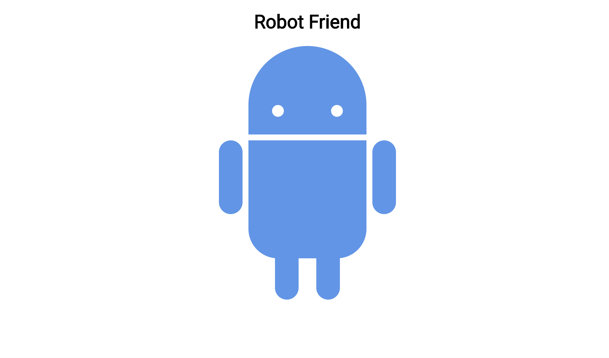

# 100 Days Of Code - Log

### Day 0: July 25, 2020
#####

**Today's Progress**: Began Angela Yu's Complete Web Dev 2020 Bootcamp

**Thoughts:** Looking to get back into programming and hone in on some of my skills.  I would like to complete the course mentioned in "Today's Progress" to become more advanced, get a deeper feel for tech and programming, and to see if I'd like to pursue it further for web dev, jobs, etc.  Follow along, here we go!

**Link to work:** https://www.udemy.com/course/the-complete-web-development-bootcamp/learn/lecture/12287482#notes

### Day 1: July 26, 2020. Sunday

**Today's Progress**: Day 1 of Angela's course.  Today I put 3 hours into it so I could complete the intermediate HTML section.  I'm trying to fly through the HTML and CSS sections so I can pick up where I once left off, learning JavaScript and the other relevant languages for Full-Stack dev.

**Thoughts** Feeling good.  I realized that the course is around 54 hours long of direct videos, and then probably another 40 hours from assignments, note-taking, challenges, et cetera.  It's a lot, but I'd like to have it under my belt.  The goal is to fork a couple of hours into it per day, so I can complete it within the next 2 months.  We'll see what happens though, since I'm not sure what to expect as the course moves on.  Today's progress can be viewed below!

**Link(s) to work**
1. https://s-munro.github.io/cv/

### Day 2: July 27, 2020. Monday

**Today's Progress**: Day 2 (three (woop!)) of Angela's course.  Today I put a couple more hours into it, and got a little past halfway through the introductory and intermediate CSS portions.  I meant to get all the way through, but that may have been a little ambitious.  A lot of this was still review, but I nevertheless encountered some obstacles and stumbled for a moment.  I've now scrapped that initial website and started working on a semi-official CV website.  I'm going to be introducing myself as a developer, and showing some of my design & dev skills.  I'm sure I'll keep working on it until its looking nice and neat.  For the time being, I don't have any links to prove it.  I'll take a screenshot and upload the photo tomorrow though. See you in the morning.

**Thoughts** This course is very interesting, Angela gives a lot of freedom with the learning, which is a sort of double-edged sword, since it leads to a lot of open-ended googling and challenge.  I'm going to complete the final two hours of CSS tomorrow and begin on Bootstrap.  Things are going to get interesting tomorrow.

**Link(s) to work**
1. N/A.  I'll upload the work-to-date tomorrow, so keep your eyes peeled for that screenshot!

### Day 3: July 28, 2020. Tuesday

**Today's Progress**: Still going!  Today I didn't get quite as far as I wanted, since I'd like to go to sleep early, but I still made quite a bit of progress.  More than an hour, easily.  Today we dug further into CSS, and began styling some parts of our own personal website.  It took me much longer to get through the lesson than I anticipated, but that's really no problem.  A lot of my time was put into learning stylistic elements like position (absolute, relative, fixed), and display (inline, inline-block, etc.).  I still need to look into display, since it's seeming to slip my mind a little.  We'll get back to that before I go to sleep though.  In the meanwhile, see below to view some of today's work.

**Thoughts** Not many thoughts today.  Other than that it's going to take a long time to finish this course.  I'd like to start putting my phone away when I work, so I make sure im distraction-free.  I also want to put quite a few hours in this weekend, so I can hurry up and finish the course.  I'm already looking into what's next.  Im thinking "Advanced CSS and SASS" and "The Complete JavaScript Course 2020" by Jonas Schmedtmann, then "JavaScript: Understanding the weird parts" By Anthony Alicea.  PHEW, what a thing.  Those ones are significantly shorter though (god bless).

**Link(s) to work**
1. How do I work this github image thing

### Day 4: July 29, 2020. Wednesday

**Today's Progress**: We in it baby.  Proud of myself for today.. But first, it's pretty wild that it's already the 29th of the month.  Let me not get sidetracked though.  Today we made good progress.  I'm currently working on the final challenge for the Intermediate CSS portion of the course.  We are re-creating a site with all of the minor details we see in our instructor's site.  It's interesting, and is a little pain-staking.  It's easy to blow-off the small details and call it good enough, but I'm taking a pause on it today so I can continue to fork as much time into as necessary tomorrow, without having to stay up so late like I would be doing tonight.  I'm content though, there's a lot into CSS, and I'm learning some things.  I'll have a lot to study and touch-up on, but I'm very content as of now.  Also, I'm particularly happy because I managed to squeeze my hour in last moment, and still go above and beyond my goal of an hour.  We're still going, and we are GOING. 

**Thoughts** I'm happy with how everything is going.  It doesn't feel like a task for me to do this; I <strong>want</strong> to do this.  Perhaps I just haven't hit the hump of doubt and laziness, but perhaps I've already passed it.  Either way, I'm looking forward to continuing.  

**Link(s) to work**
1. Not today, just because I don't want to flood the repository with too many images.  Let's scatter them like prizes.  I'll upload the finished file tomorrow just to show what I've done, though.  Quite proud.

### Day 5: July 30, 2020. Thursday

**Today's Progress**: Big news tomorrow so I'm keeping today's post short.  Today I didn't dive much into writing out code, but looked into learning a little more about front end vs back-end, how the internet works, the history of the web, et cetera.  I'm itching to get back into writing code out though, so we will be back to that shortly.  Thankfully tomorrow marks the beginning of the weekend, which means more free time for me to work on this!

**Thoughts** Big news tomorrow, that I'll be putting on here! Very excited.

**Link(s) to work**
Not available today

Screen Shot 2020-08-01 at 12.11.57 AM.png

### Day 6: July 31, 2020. Friday

**Today's Progress**: So today was big news day.  After much research, i decided to switch courses before I dug into too far, so that I could take Andrei Neagoie's Web Dev bootcamp instead.  I chose this just because Andrei has a reputation for his course being very up-to-date, and because he makes 'getting a job' the goal of the course.  This means that the information is relevant, and the projects are something to be proud of.  With that in mind, I dug into it today.

Today I put about three or four hours into it, and made it to the end of advanced CSS.  Andrei definitely moves faster than Angela, and leaves a lot of room for exploring and learning on your own.  Today's greatest progress was learning about flex boxes, and arranging objects in that manner.  Flex boxes seem simple enough in theory, but in application they've been difficult.  I played around with a flexbox app that teaches you flexbox by commanding you to move frog images to various lilipads, and I did very well!  We progressed a bit further; however, and came across a challenge where Andrei asks us to arrange an android logo together with flexbox.  I've had little to no success with this, and will have to dive into research tomorrow, since I'm full of questions.  For the time being, i'll show the relevant images from today below, so that you can get a feel for what I've been doing.

**Thoughts** I don't quite like Andrei's teaching style as much, but I appreciate what he does and his goal with the course, so I'm content with the switch.  Regardless, I think it's going to be very hard, so I'm going to have to lean-in and see what I'm made of.  My flexbox project and activities are shown below.  The frog flexbox was arranging the frogs to their corresponding lilipads using flexbox commands.  The android image is our challenge, where we are required to organize the android logo into the correct arrangement.  It's been confusing, but I'm looking forward to waking up early and researching to get the hang of it.  See you tomorrow! :)

**Link(s) to work**
1. 
2. 

### Day 7: August 1, 2020. Saturday

**Today's Progress**: Today I put an obscene number of hours into the course. We worked all the way through the Advanced CSS, Bootstrap 4, Flexbox, and CSS Grid sections, covering a lot of ground.  It was a difficult day; dealing with formatting and spacing gets confusing quickly, but I'm slowly starting to get the hang of everything.  I'm currently in the process of creating a format/template for a website homepage using a combination of flexbox and CSS grid.  Although I really loved the bootstrap resources, I definitely prefer using flexbox and grid for formatting/aligning/etc.  I attached the final version of the android logo (from yesterday) below, and I'll be sure to upload some of my upcoming work throughout the next couple of days.  See you tomorrow!

Today's projects:
  1. Android w/ flexbox
  2. Bootstrap landing page
  3. Site with email list (MailChimp)
  4. CSSGrid
  5. Grid spacing project

**Thoughts** 
Very excited, as per usual.  It's the weekend, so I'm pumping as much time into this as possible, and I'm loving it.  Looking forward to getting started on JavaScript.  I should be able to at least begin the JS section tomorrow, and if tomorrow turns out anything like today, I'll probably be able to power all the way through it.  Anyways, with that, here's the android photo:

**Link(s) to work**
1. 

### Day 8: August 2, 2020. Sunday

**Today's Progress**: Happy Sunday; today was another busy one.  Instead of powering all of the way through the JS portion of my course, I opted to touch-up my CSS Grid/Flexbox project, then walked through the solution and re-did the project in a different manner. I wanted to make sure I really understood what I was doing, since alignment is so key, and I slowed down as I approached the JS section.  Tomorrow, to compensate, I'm going to go through a JS-heavy day.  In the meanwhile, while tonight finishes up, I'm going to begin my own personal project: a portfolio.  I'm planning on slowly working o the foundation for my portfolio, and touching it up over time.  Eventually I'll add my JS projects to it, links to my github, et cetera.

**Thoughts** 
Today was a good day. My only issue is that I wish there were more hours, so I could keep going.  See you again tomorrow.

**Link(s) to work**
No images today, my pesky friends.

